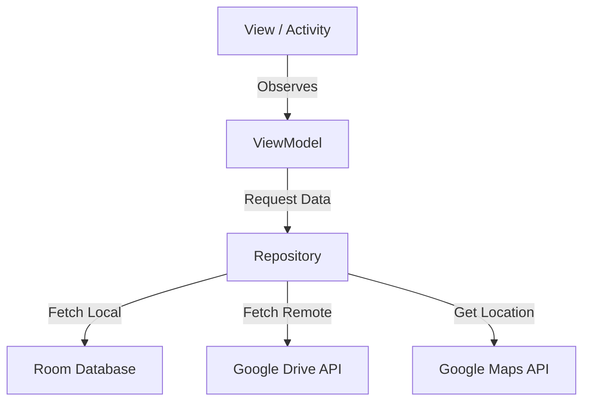

# ⚖️ Sistema de Presentación de Actividades Procesales (Mobile)

> **Nota:** Este repositorio sirve como **Showcase** y documentación técnica del proyecto. El código fuente se mantiene privado por razones de propiedad intelectual y viabilidad comercial.

## 📱 Descripción del Proyecto

Partimos de la base de que una **Presentación de Actividad Procesal** es un escrito en el cual se solicitan medidas judiciales al juez a los efectos de que se instruya la causa con las evidencias correspondientes que ayuden a esclarecer la situación en favor del cliente.

Esta es una Aplicación móvil nativa desarrollada en **Kotlin** diseñada para modernizar la labor del **Abogado Litigante**. 

En el contexto post-pandemia, el sistema judicial ha migrado hacia la virtualidad. Esta herramienta cubre la necesidad de movilidad, permitiendo a los profesionales del derecho gestionar **Expedientes** y realizar **Presentaciones de Actividad Procesal** de forma remota, segura y geolocalizada.

La app permite instruir causas con evidencias multimedia (fotos, documentos), integrándose con la nube para garantizar que la información llegue clara y organizada a los organismos de control.

---

## 💡 El Problema que Resuelve
* **Inmediatez:** Ante situaciones de violencia o delitos menores, la movilidad y el registro inmediato son factores vitales.
* **Gestión de Evidencia:** Los usuarios demandan herramientas para adjuntar fotos, audios y documentos en el momento exacto de los hechos.
* **Geolocalización:** Las fuerzas de seguridad requieren que la información llegue clara y con ubicación precisa para optimizar su intervención.

---

## 🚀 Funcionalidades Clave

### 1. Gestión de Identidad Profesional
* Registro seguro de abogados (Matrícula Profesional, Domicilio Legal).
* Autenticación y protección de datos sensibles.
``

### 2. Digitalización de Expedientes
* Creación de expedientes con metadatos jurídicos: Número de expediente, Carátula, Fuero, Jurisdicción, Ubicación del hecho y Delito.
* Historial organizado cronológicamente.
* **Filtrado inteligente** por estado, fuero o carátula.
* **Geolocalización del Hecho:** Integración con **Google Maps API** y autocompletado de direcciones con **Google Places** para precisar el lugar del incidente.
``
``

### 3. Presentaciones y Evidencia (Core Feature)
* Redacción de escritos judiciales solicitando medidas al juez.
* **Gestión de Evidencia en la Nube:** Subida de archivos (PDF, Imágenes o vídeos) directamente a **Google Drive** mediante su API.
``
``

### 4. Productividad
* Sistema de **Notificaciones** para recordar presentaciones pendientes tras X días de inactividad.
* Feedback visual de estados (Pendiente, Aceptada, Rechazada).

---

## 🛠️ Stack Tecnológico y Arquitectura

Este proyecto fue construido siguiendo los estándares modernos de desarrollo Android para asegurar escalabilidad y mantenimiento.

* **Lenguaje:** Kotlin (100%).
* **Arquitectura:** MVVM (Model-View-ViewModel) para separar la lógica de negocio de la interfaz.
* **Diseño de Código:** Package by Feature (Agrupación por funcionalidad) para modularidad.
* **Persistencia de Datos Local:** Room Database (SQLite abstracto).
* **Almacenamiento en Nube:** Google Drive API (REST).
* **Servicios de Ubicación:** Google Maps SDK & Places API.
* **UI/UX:** Material Design, XML Layouts.
* **Concurrencia:** Coroutines & Flow.

### Diagrama de Arquitectura (Simplificado)

## 📩 Contacto y Oportunidades

Este proyecto representa una solución sólida con potencial comercial para estudios jurídicos y organismos judiciales. Si te interesa conocer más sobre la arquitectura, ver una demo en vivo o discutir oportunidades laborales, no dudes en contactarme.

| Canal | Detalle |
| :--- | :--- |
| **Desarrollador** | **Luciano Rafael Zanni Giuliano** |
| **Email** | [lucianozannig@gmail.com](mailto:lucianozannig@gmail.com) |
| **LinkedIn** | [linkedin.com/in/lucianozannig](https://www.linkedin.com/in/lucianozannig) |
| **GitHub** | [@lucianoZG](https://github.com/lucianoZG) |

> *Abierto a roles de Java Backend Developer / Android Developer.*
