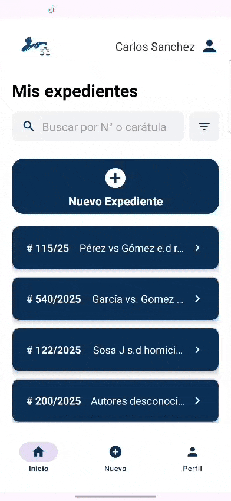
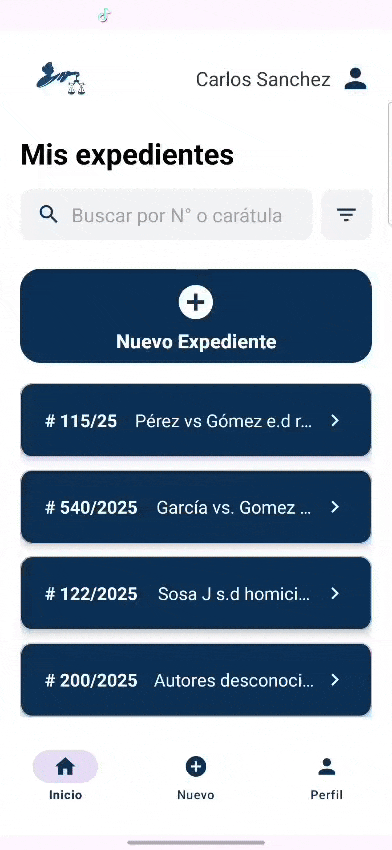
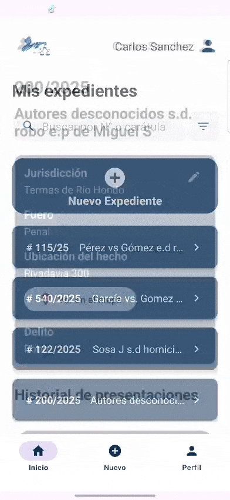
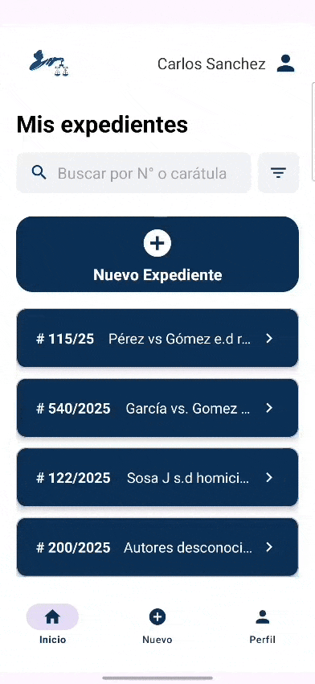
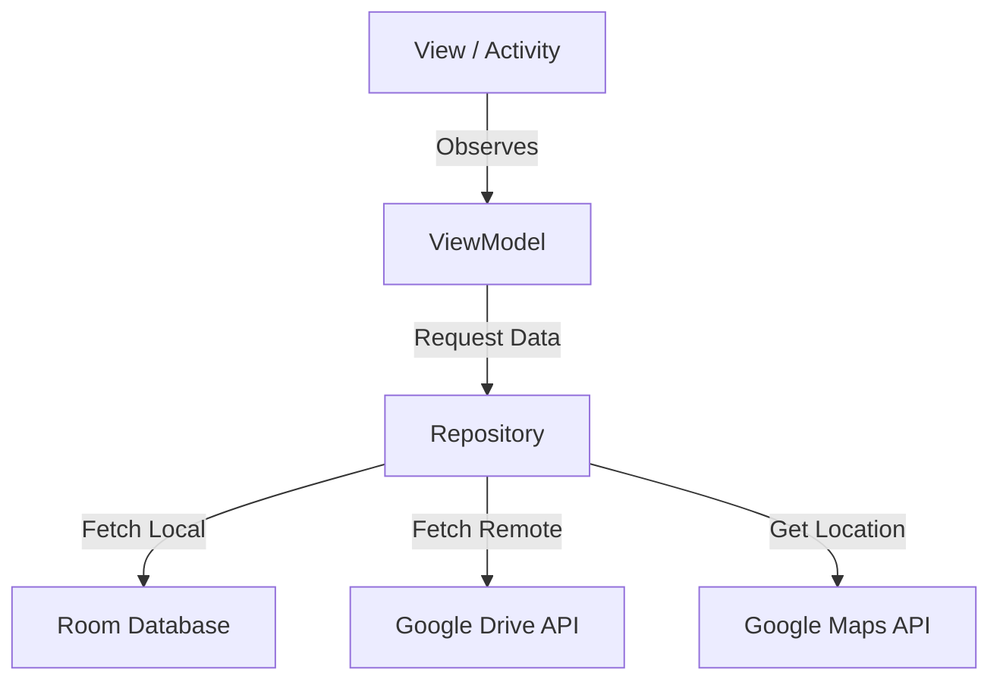

# ⚖️ Judicial Procedural Management System (Mobile)

> **Note:** This repository serves as a **Showcase** and technical documentation. The source code remains private due to Intellectual Property and commercial viability reasons.

## 📱 Project Description

This project is built upon the concept of a **"Procedural Writ" (Presentación)**: a formal written request submitted to a judge to solicit judicial measures and present evidence that helps clarify a situation in favor of the client.

This is a **Native Mobile Application** developed in **Kotlin**, designed to modernize the workflow of the **Litigating Attorney**.

In the post-pandemic context, the judicial system has shifted towards virtualization. This tool addresses the critical need for mobility, allowing legal professionals to manage **Case Files** and file **Procedural Writs** remotely, securely, and with precise geolocation.

The app enables the instruction of cases with multimedia evidence (photos, documents), integrating with the cloud to ensure information reaches control bodies in a clear and organized manner.

---

## 💡 The Problem Solved
* **Immediacy:** In situations involving violence or misdemeanors, mobility and immediate recording are vital factors.
* **Evidence Management:** Users demand tools to attach photos, audio, and documents at the exact moment and place of the events.
* **Geolocation:** Law enforcement agencies require information to arrive clearly and with precise location data to optimize their intervention.

---

## 🚀 Key Features

### 1. Professional Identity Management
* Secure registration for attorneys (Bar Association License ID, Legal Domicile).
* Authentication and protection of sensitive data.
  

### 2. Case File Digitization
* Creation of digital Case Files with legal metadata: Case Number, Docket Title (Carátula), Court Jurisdiction, Crime Type, and Location.
* Chronologically organized history.
* **Smart Filtering** by status, jurisdiction, or title.
* **Geolocation of the Fact:** Integration with **Google Maps API** and address autocomplete via **Google Places** to pinpoint the exact incident location.
  

### 3. Writs & Evidence (Core Feature)
* Drafting of judicial writs requesting measures from the judge.
* **Cloud Evidence Management:** Direct upload of files (PDF, Images, or Videos) to **Google Drive** via its REST API.
  

### 4. Productivity
* **Notification System** to remind the user of pending filings after X days of inactivity.
* Visual feedback on status (Pending, Accepted, Rejected).

---

## 🛠️ Tech Stack & Architecture

This project was built following modern Android development standards to ensure scalability and maintainability.

* **Language:** Kotlin (100%).
* **Architecture:** MVVM (Model-View-ViewModel) to separate business logic from the UI.
* **Code Design:** Package by Feature for modularity.
* **Local Persistence:** Room Database (Abstract SQLite).
* **Cloud Storage:** Google Drive API (REST).
* **Location Services:** Google Maps SDK & Places API.
* **UI/UX:** Material Design, XML Layouts.
* **Concurrency:** Coroutines & Flow.

### Architecture Diagram (Simplified)

## 📩 Contact & Opportunities

This project represents a solid solution with commercial potential for law firms and judicial bodies. If you are interested in learning more about the architecture, seeing a live demo, or discussing job opportunities, please do not hesitate to contact me.

| Channel | Detail |
| :--- | :--- |
| **Developer** | **Luciano Rafael Zanni Giuliano** |
| **Email** | [lucianozannig@gmail.com](mailto:lucianozannig@gmail.com) |
| **LinkedIn** | [linkedin.com/in/lucianozannig](https://www.linkedin.com/in/lucianozannig) |
| **GitHub** | [@lucianoZG](https://github.com/lucianoZG) |

> *Open to Java Backend Developer / Android Developer roles.*
